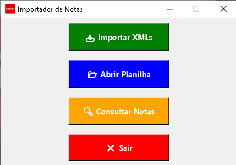

# 📄 Sistema de Controle de NFD
### 🚀 Automação de Notas Fiscais de Devolução com Python

> Aplicação desenvolvida em Python para automatizar o controle e processamento de Notas Fiscais de Devolução (NFD), com interface gráfica intuitiva, integração com planilhas Excel e geração de versão executável para Windows.

---

## 📌 Sobre o Projeto

O **Sistema de Controle de NFD** foi criado para otimizar o processo de análise e controle de Notas Fiscais de Devolução, reduzindo atividades manuais e aumentando a produtividade operacional.

A aplicação permite que o usuário selecione uma planilha Excel com os dados das notas e execute o processamento automaticamente, gerando resultados de forma rápida e padronizada.

Este projeto foi desenvolvido com foco em resolver uma necessidade real de negócio, demonstrando a aplicação prática de automação com Python.

---

## ✨ Funcionalidades

- 📂 Importação de planilhas Excel (`.xlsx`)
- 🔍 Processamento automático dos dados
- 🖥️ Interface gráfica amigável
- 📊 Geração de resultados padronizados
- 📝 Configuração por arquivo externo (`config.py`)
- 🪟 Versão executável para Windows (`.exe`)
- 🎨 Ícone personalizado da aplicação

---

## 🛠️ Tecnologias Utilizadas

---

## 📸 Interface da Aplicação

---

## 💡 Caso de Uso
### Este sistema foi desenvolvido para automatizar uma rotina administrativa relacionada ao controle de Notas Fiscais de Devolução, reduzindo erros manuais e tornando o processo mais eficiente.

- 📈 Benefícios da Solução
- ⏱️ Redução do tempo de processamento
- 📉 Menor incidência de erros manuais
- 📋 Padronização das análises
- 👨‍💼 Facilidade de uso para usuários finais
- 🪟 Distribuição simplificada via executável
- 🧠 Aprendizados Desenvolvidos

Durante o desenvolvimento deste projeto, foram aplicados conhecimentos em:

- 🐍 Programação em Python
- 🖥️ Desenvolvimento de interfaces gráficas
- 📊 Manipulação de planilhas Excel
- 📦 Empacotamento de aplicações com PyInstaller
- ⚙️ Organização e estruturação de projetos
- 📄 Documentação técnica com Markdown

---

👨‍💻 Autor

Gustavo Matias Silva 

